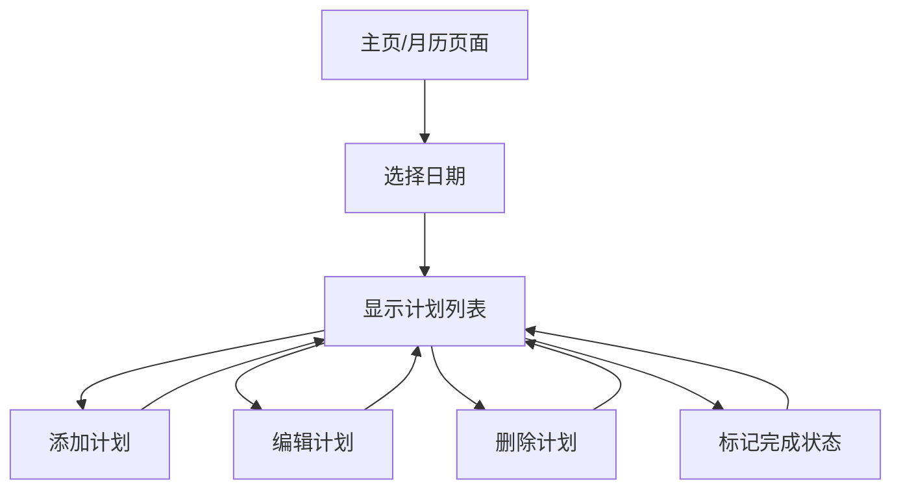

## 1. Product Overview
个人月计划管理网站，帮助用户有效管理每月的待办事项和计划安排。用户可以通过月历视图直观地查看和管理每日计划，支持添加、删除、修改计划，并通过复选框标记完成状态。

目标用户：需要个人时间管理和任务规划的个人用户，提升工作效率和生活规划能力。

## 2. Core Features

### 2.1 User Roles
| Role | Registration Method | Core Permissions |
|------|---------------------|------------------|
| 普通用户 | 邮箱注册/匿名使用 | 创建、编辑、删除个人计划，标记完成状态 |

### 2.2 Feature Module
网站主要包含以下页面：
1. **主页/月历页面**：月历视图、日期选择、计划列表显示
2. **计划管理页面**：添加计划、编辑计划、删除计划、完成状态切换

### 2.3 Page Details
| Page Name | Module Name | Feature description |
|-----------|-------------|---------------------|
| 主页/月历页面 | 月历视图 | 显示当前月份日历，每个日期格子显示日期数字和计划数量指示器 |
| 主页/月历页面 | 月份导航 | 支持上一月、下一月切换，显示当前年月 |
| 主页/月历页面 | 日期选择 | 点击日期高亮显示，右侧或下方显示该日计划列表 |
| 主页/月历页面 | 计划列表 | 显示选中日期的所有计划，按创建时间排序 |
| 计划管理 | 添加计划 | 在选中日期添加新计划，输入计划内容，实时保存 |
| 计划管理 | 编辑计划 | 点击计划文本进入编辑模式，修改内容后保存 |
| 计划管理 | 删除计划 | 每个计划项提供删除按钮，确认后删除 |
| 计划管理 | 完成标记 | 每个计划项前面显示复选框，点击切换完成/未完成状态 |
| 计划管理 | 计划状态显示 | 已完成的计划显示删除线和灰色文字，未完成显示正常样式 |

## 3. Core Process
用户操作流程：
1. 用户进入主页，默认显示当前月份的月历
2. 点击任意日期，查看该日期的计划列表
3. 在计划列表区域可以添加新计划、编辑现有计划、删除计划
4. 通过复选框标记计划完成状态
5. 可以切换月份查看其他日期的计划

## 4. User Interface Design

### 4.1 Design Style
- 主色调：蓝色系（#2563eb 主色，#3b82f6 辅助色）
- 按钮样式：圆角矩形，悬停效果
- 字体：系统默认字体，标题16px，正文14px
- 布局：响应式网格布局，月历为主，计划列表为侧栏
- 图标：使用简洁的线性图标，如+号表示添加，垃圾桶表示删除

### 4.2 Page Design Overview
| Page Name | Module Name | UI Elements |
|-----------|-------------|-------------|
| 主页/月历页面 | 月历视图 | 7x6网格布局，每个格子显示日期数字，有计划的日期显示小圆点标记，当前日期高亮显示 |
| 主页/月历页面 | 月份导航 | 顶部居中显示"2024年1月"，左右箭头按钮切换月份 |
| 主页/月历页面 | 计划列表 | 右侧边栏或底部卡片，显示选中日期的计划，每项计划左侧有复选框 |
| 计划管理 | 添加输入框 | 底部输入框，带"添加计划"按钮，回车或点击按钮添加 |
| 计划管理 | 计划项 | 每行显示复选框+计划文本+删除按钮，完成的计划文字加删除线 |

### 4.3 Responsiveness
- 桌面优先设计，在大屏幕上显示为月历+右侧计划列表的两栏布局
- 平板和移动设备自适应，小屏幕下月历和计划列表垂直排列
- 触摸设备优化，按钮和交互元素有足够点击区域