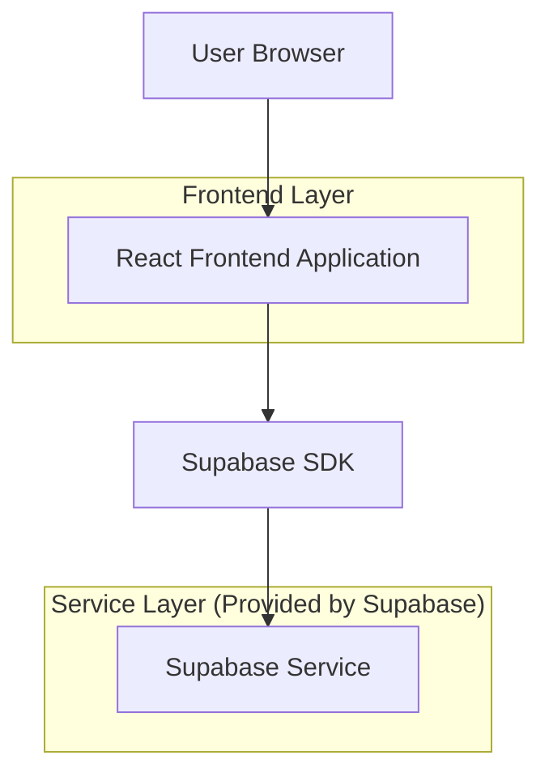
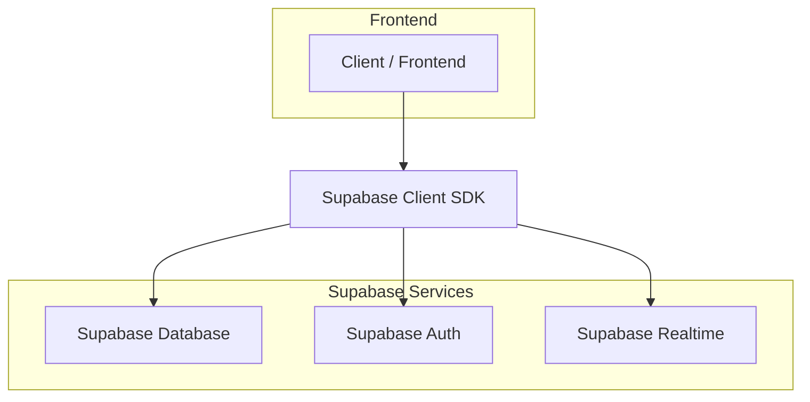
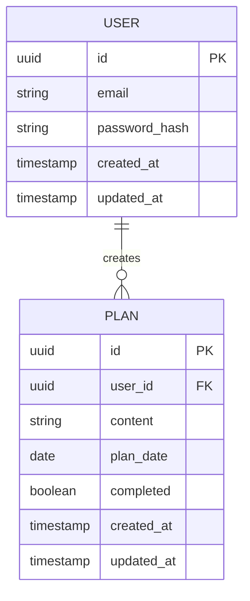

## 1. Architecture design



## 2. Technology Description
- Frontend: React@18 + tailwindcss@3 + vite
- Initialization Tool: vite-init
- Backend: Supabase (提供数据库、认证、实时功能)
- Database: Supabase PostgreSQL

## 3. Route definitions
| Route | Purpose |
|-------|---------|
| / | 主页/月历页面，显示月历和计划管理 |
| /login | 登录页面（可选，支持匿名使用） |

## 4. API definitions

### 4.1 Core API

计划管理相关
```
GET /api/plans?date=YYYY-MM-DD
```

Request:
| Param Name| Param Type  | isRequired  | Description |
|-----------|-------------|-------------|-------------|
| date | string | true | 日期，格式：YYYY-MM-DD |

Response:
| Param Name| Param Type  | Description |
|-----------|-------------|-------------|
| plans | array | 计划列表 |

计划数据结构：
```json
{
  "id": "uuid",
  "content": "计划内容",
  "date": "2024-01-15",
  "completed": false,
  "created_at": "2024-01-01T00:00:00Z",
  "updated_at": "2024-01-01T00:00:00Z"
}
```

```
POST /api/plans
```

Request:
| Param Name| Param Type  | isRequired  | Description |
|-----------|-------------|-------------|-------------|
| content | string | true | 计划内容 |
| date | string | true | 日期，格式：YYYY-MM-DD |

```
PUT /api/plans/:id
```

Request:
| Param Name| Param Type  | isRequired  | Description |
|-----------|-------------|-------------|-------------|
| content | string | false | 计划内容 |
| completed | boolean | false | 完成状态 |

```
DELETE /api/plans/:id
```

## 5. Server architecture diagram



## 6. Data model

### 6.1 Data model definition


### 6.2 Data Definition Language

用户表 (users)
```sql
-- create table
CREATE TABLE users (
    id UUID PRIMARY KEY DEFAULT gen_random_uuid(),
    email VARCHAR(255) UNIQUE,
    password_hash VARCHAR(255),
    created_at TIMESTAMP WITH TIME ZONE DEFAULT NOW(),
    updated_at TIMESTAMP WITH TIME ZONE DEFAULT NOW()
);

-- create index
CREATE INDEX idx_users_email ON users(email);
```

计划表 (plans)
```sql
-- create table
CREATE TABLE plans (
    id UUID PRIMARY KEY DEFAULT gen_random_uuid(),
    user_id UUID REFERENCES users(id) ON DELETE CASCADE,
    content TEXT NOT NULL,
    plan_date DATE NOT NULL,
    completed BOOLEAN DEFAULT false,
    created_at TIMESTAMP WITH TIME ZONE DEFAULT NOW(),
    updated_at TIMESTAMP WITH TIME ZONE DEFAULT NOW()
);

-- create index
CREATE INDEX idx_plans_user_id ON plans(user_id);
CREATE INDEX idx_plans_plan_date ON plans(plan_date);
CREATE INDEX idx_plans_user_date ON plans(user_id, plan_date);

-- grant permissions
GRANT SELECT ON plans TO anon;
GRANT ALL ON plans TO authenticated;
```

匿名用户支持
```sql
-- 为匿名用户创建默认计划表（如果不使用用户系统）
CREATE TABLE public_plans (
    id UUID PRIMARY KEY DEFAULT gen_random_uuid(),
    content TEXT NOT NULL,
    plan_date DATE NOT NULL,
    completed BOOLEAN DEFAULT false,
    session_id TEXT,
    created_at TIMESTAMP WITH TIME ZONE DEFAULT NOW(),
    updated_at TIMESTAMP WITH TIME ZONE DEFAULT NOW()
);

-- grant permissions
GRANT ALL ON public_plans TO anon;
GRANT ALL ON public_plans TO authenticated;
```