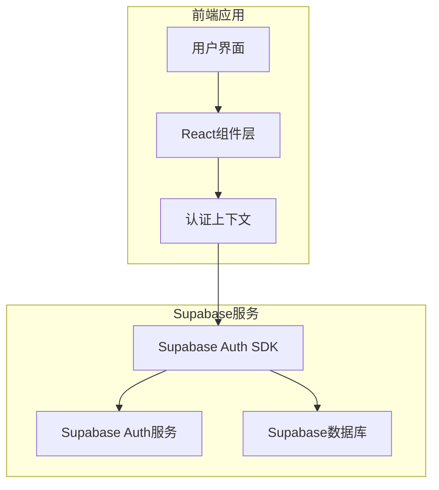
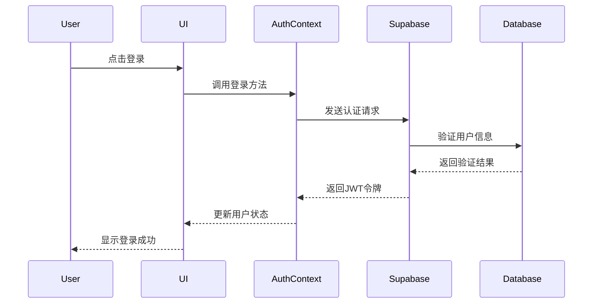

# 用户认证功能技术文档

## 1. 功能需求分析

### 1.1 核心功能需求
- **用户注册**：支持邮箱注册，包含邮箱验证
- **用户登录**：支持邮箱+密码登录
- **用户退出**：安全退出当前会话
- **密码重置**：支持忘记密码功能
- **用户状态管理**：全局用户登录状态管理
- **数据隔离**：用户只能查看和管理自己的计划数据

### 1.2 用户体验需求
- **匿名使用**：支持无需注册即可使用基础功能
- **平滑过渡**：匿名用户注册后数据可以迁移
- **记住登录状态**：支持自动登录功能
- **响应式设计**：适配移动端和桌面端

### 1.3 安全性需求
- **密码加密**：使用bcrypt进行密码哈希
- **会话管理**：JWT令牌管理用户会话
- **输入验证**：前端和后端双重验证
- **错误处理**：友好的错误提示信息

## 2. 技术架构设计

### 2.1 系统架构图


### 2.2 数据流设计


## 3. 数据库设计

### 3.1 用户表结构更新
```sql
-- 用户表（使用Supabase Auth自动管理）
-- 扩展用户元数据表
CREATE TABLE public.profiles (
    id UUID REFERENCES auth.users(id) ON DELETE CASCADE PRIMARY KEY,
    email TEXT UNIQUE NOT NULL,
    full_name TEXT,
    avatar_url TEXT,
    bio TEXT,
    created_at TIMESTAMP WITH TIME ZONE DEFAULT NOW(),
    updated_at TIMESTAMP WITH TIME ZONE DEFAULT NOW()
);

-- 创建更新时间的触发器
CREATE OR REPLACE FUNCTION update_profiles_updated_at()
RETURNS TRIGGER AS $$
BEGIN
    NEW.updated_at = NOW();
    RETURN NEW;
END;
$$ LANGUAGE plpgsql;

CREATE TRIGGER update_profiles_updated_at
    BEFORE UPDATE ON public.profiles
    FOR EACH ROW
    EXECUTE FUNCTION update_profiles_updated_at();

-- 授权访问权限
GRANT ALL ON public.profiles TO authenticated;
GRANT SELECT ON public.profiles TO anon;
```

### 3.2 计划表结构更新
```sql
-- 更新计划表以支持用户关联
ALTER TABLE plans 
ADD COLUMN IF NOT EXISTS user_id UUID REFERENCES auth.users(id) ON DELETE CASCADE;

-- 为现有数据添加默认用户（迁移用）
UPDATE plans SET user_id = auth.uid() WHERE user_id IS NULL;

-- 创建用户计划索引
CREATE INDEX IF NOT EXISTS idx_plans_user_id ON plans(user_id);
CREATE INDEX IF NOT EXISTS idx_plans_user_date ON plans(user_id, plan_date);

-- 更新权限策略
ALTER TABLE plans ENABLE ROW LEVEL SECURITY;

-- 创建行级安全策略
CREATE POLICY "用户只能查看自己的计划" ON plans
    FOR SELECT USING (auth.uid() = user_id);

CREATE POLICY "用户只能插入自己的计划" ON plans
    FOR INSERT WITH CHECK (auth.uid() = user_id);

CREATE POLICY "用户只能更新自己的计划" ON plans
    FOR UPDATE USING (auth.uid() = user_id);

CREATE POLICY "用户只能删除自己的计划" ON plans
    FOR DELETE USING (auth.uid() = user_id);
```

## 4. 组件设计

### 4.1 认证相关组件
```
src/
├── components/
│   ├── auth/
│   │   ├── LoginForm.jsx      # 登录表单组件
│   │   ├── RegisterForm.jsx   # 注册表单组件
│   │   ├── AuthModal.jsx      # 认证弹窗组件
│   │   ├── UserMenu.jsx       # 用户菜单组件
│   │   └── ProtectedRoute.jsx # 受保护路由组件
│   └── ...
├── contexts/
│   └── AuthContext.jsx        # 认证上下文
└── hooks/
    └── useAuth.js             # 认证自定义钩子
```

### 4.2 核心组件说明

#### LoginForm.jsx
- 邮箱和密码输入
- 记住我选项
- 忘记密码链接
- 表单验证
- 错误处理

#### RegisterForm.jsx
- 邮箱、密码、确认密码输入
- 用户协议勾选
- 邮箱格式验证
- 密码强度检查
- 注册成功提示

#### AuthContext.jsx
- 用户状态管理
- 登录/注册/退出方法
- 自动登录逻辑
- 错误状态管理

#### UserMenu.jsx
- 用户头像和名称显示
- 下拉菜单（个人资料、设置、退出）
- 响应式设计

## 5. 路由设计

### 5.1 路由配置更新
```jsx
// 新增路由
const routes = [
  {
    path: '/',
    element: <Layout />,
    children: [
      { index: true, element: <HomePage /> },
      { path: 'profile', element: <ProtectedRoute><ProfilePage /></ProtectedRoute> }
    ]
  },
  { path: '/login', element: <LoginPage /> },
  { path: '/register', element: <RegisterPage /> },
  { path: '/forgot-password', element: <ForgotPasswordPage /> }
]
```

### 5.2 路由保护
```jsx
// ProtectedRoute 组件实现
const ProtectedRoute = ({ children }) => {
  const { user, loading } = useAuth();
  
  if (loading) return <LoadingSpinner />;
  if (!user) return <Navigate to="/login" replace />;
  
  return children;
}
```

## 6. 状态管理设计

### 6.1 认证状态结构
```javascript
const authState = {
  user: {
    id: 'uuid',
    email: 'user@example.com',
    profile: {
      full_name: '用户名',
      avatar_url: 'https://...'
    }
  },
  session: {
    access_token: 'jwt_token',
    refresh_token: 'refresh_token',
    expires_at: 1234567890
  },
  loading: false,
  error: null,
  isAuthenticated: true
}
```

### 6.2 认证方法设计
```javascript
const authMethods = {
  // 登录
  login: async (email, password, rememberMe = false) => { /* ... */ },
  
  // 注册
  register: async (email, password, userData) => { /* ... */ },
  
  // 退出
  logout: async () => { /* ... */ },
  
  // 重置密码
  resetPassword: async (email) => { /* ... */ },
  
  // 更新密码
  updatePassword: async (newPassword) => { /* ... */ },
  
  // 获取当前用户
  getCurrentUser: () => { /* ... */ },
  
  // 检查认证状态
  checkAuth: async () => { /* ... */ }
}
```

## 7. API接口设计

### 7.1 认证相关API
```javascript
// 用户认证API
const authAPI = {
  // 登录
  login: async (email, password) => {
    const { data, error } = await supabase.auth.signInWithPassword({
      email,
      password
    });
    return { data, error };
  },
  
  // 注册
  register: async (email, password, userData) => {
    const { data, error } = await supabase.auth.signUp({
      email,
      password,
      options: {
        data: userData
      }
    });
    return { data, error };
  },
  
  // 退出
  logout: async () => {
    const { error } = await supabase.auth.signOut();
    return { error };
  },
  
  // 重置密码
  resetPassword: async (email) => {
    const { error } = await supabase.auth.resetPasswordForEmail(email);
    return { error };
  },
  
  // 获取当前会话
  getSession: async () => {
    const { data: { session }, error } = await supabase.auth.getSession();
    return { session, error };
  }
}
```

### 7.2 用户资料API
```javascript
// 用户资料API
const profileAPI = {
  // 获取用户资料
  getProfile: async (userId) => {
    const { data, error } = await supabase
      .from('profiles')
      .select('*')
      .eq('id', userId)
      .single();
    return { data, error };
  },
  
  // 更新用户资料
  updateProfile: async (userId, updates) => {
    const { data, error } = await supabase
      .from('profiles')
      .update(updates)
      .eq('id', userId)
      .select()
      .single();
    return { data, error };
  },
  
  // 创建用户资料
  createProfile: async (userId, profileData) => {
    const { data, error } = await supabase
      .from('profiles')
      .insert([{ id: userId, ...profileData }])
      .select()
      .single();
    return { data, error };
  }
}
```

## 8. 与现有功能整合

### 8.1 计划数据隔离
```javascript
// 更新后的计划API，支持用户隔离
const updatedPlanAPI = {
  getPlans: async (date, userId) => {
    if (!userId) {
      // 匿名用户使用本地存储
      return localStorageAPI.getPlans(date);
    }
    
    // 登录用户使用Supabase，自动应用RLS
    const { data, error } = await supabase
      .from('plans')
      .select('*')
      .eq('plan_date', date)
      .order('created_at', { ascending: true });
    
    return { data: data || [], error };
  },
  
  addPlan: async (content, date, userId) => {
    if (!userId) {
      return localStorageAPI.addPlan(content, date);
    }
    
    const { data, error } = await supabase
      .from('plans')
      .insert([{ 
        content, 
        plan_date: date, 
        completed: false,
        user_id: userId // 自动关联当前用户
      }])
      .select()
      .single();
    
    return { data, error };
  }
}
```

### 8.2 匿名数据迁移
```javascript
// 匿名用户注册后的数据迁移
const migrateAnonymousData = async (userId) => {
  try {
    // 1. 获取本地存储的所有计划
    const allPlans = localStorageAPI.getAllPlans();
    
    // 2. 将本地计划迁移到用户账户
    for (const plan of allPlans) {
      await supabase.from('plans').insert([{
        content: plan.content,
        plan_date: plan.plan_date,
        completed: plan.completed,
        user_id: userId,
        created_at: plan.created_at,
        updated_at: plan.updated_at
      }]);
    }
    
    // 3. 清空本地存储
    localStorageAPI.clearAllPlans();
    
    return { success: true };
  } catch (error) {
    console.error('数据迁移失败:', error);
    return { success: false, error };
  }
}
```

## 9. 错误处理设计

### 9.1 认证错误类型
```javascript
const authErrors = {
  INVALID_CREDENTIALS: '邮箱或密码错误',
  EMAIL_NOT_CONFIRMED: '请先验证您的邮箱',
  USER_NOT_FOUND: '用户不存在',
  EMAIL_ALREADY_EXISTS: '该邮箱已被注册',
  WEAK_PASSWORD: '密码强度不足',
  NETWORK_ERROR: '网络连接错误',
  SERVER_ERROR: '服务器错误'
}
```

### 9.2 错误处理策略
```javascript
// 统一的错误处理
const handleAuthError = (error) => {
  if (error.message.includes('Invalid login credentials')) {
    return authErrors.INVALID_CREDENTIALS;
  }
  if (error.message.includes('Email not confirmed')) {
    return authErrors.EMAIL_NOT_CONFIRMED;
  }
  if (error.message.includes('User not found')) {
    return authErrors.USER_NOT_FOUND;
  }
  // ... 其他错误处理
  
  return authErrors.SERVER_ERROR;
}
```

## 10. 性能优化

### 10.1 缓存策略
```javascript
// 用户资料缓存
const userProfileCache = {
  data: null,
  timestamp: null,
  ttl: 5 * 60 * 1000, // 5分钟
  
  get: () => {
    if (!userProfileCache.data || 
        Date.now() - userProfileCache.timestamp > userProfileCache.ttl) {
      return null;
    }
    return userProfileCache.data;
  },
  
  set: (data) => {
    userProfileCache.data = data;
    userProfileCache.timestamp = Date.now();
  },
  
  clear: () => {
    userProfileCache.data = null;
    userProfileCache.timestamp = null;
  }
}
```

### 10.2 懒加载
```javascript
// 认证组件懒加载
const LoginForm = lazy(() => import('./components/auth/LoginForm'));
const RegisterForm = lazy(() => import('./components/auth/RegisterForm'));

// 在需要时才加载认证组件
const AuthModal = ({ mode }) => {
  return (
    <Suspense fallback={<LoadingSpinner />}>
      {mode === 'login' ? <LoginForm /> : <RegisterForm />}
    </Suspense>
  );
}
```

## 11. 测试策略

### 11.1 单元测试
- 认证API测试
- 表单验证测试
- 错误处理测试
- 状态管理测试

### 11.2 集成测试
- 登录流程测试
- 注册流程测试
- 数据迁移测试
- 权限控制测试

### 11.3 端到端测试
- 完整用户旅程测试
- 匿名用户转换测试
- 多用户并发测试

## 12. 部署注意事项

### 12.1 环境变量配置
```bash
# .env 文件
VITE_SUPABASE_URL=your_supabase_url
VITE_SUPABASE_ANON_KEY=your_supabase_anon_key
VITE_SITE_URL=your_site_url
```

### 12.2 Supabase配置
- 启用邮箱认证
- 配置邮件模板
- 设置密码策略
- 配置OAuth提供商（可选）

### 12.3 安全设置
- 配置CORS策略
- 设置安全的Cookie策略
- 启用HTTPS
- 配置内容安全策略

这个技术文档为月计划管理网站的用户认证功能提供了完整的设计方案，可以作为开发实施的指导文档。